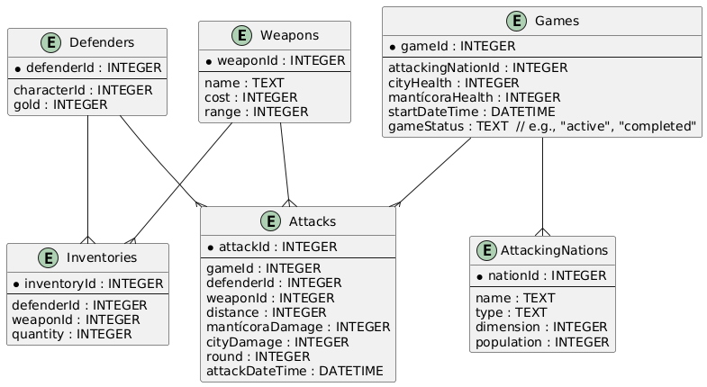
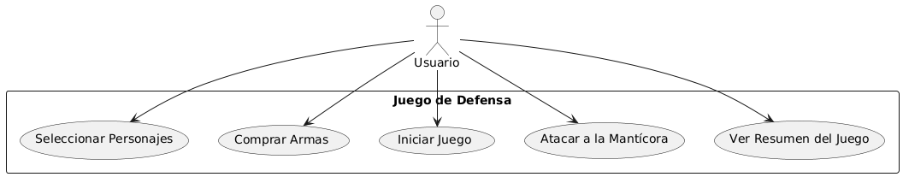

# Juego de Ataque de la Mantícora

Este proyecto implementa un juego donde dos personajes defienden una ciudad del ataque de una mantícora. El juego está construido usando ASP.NET Core MVC con C# para el backend y JavaScript puro para el frontend. La aplicación sigue el patrón de Clean Architecture y utiliza SQLite para la persistencia de datos.

## Tabla de Contenidos

- [Características](#características)
- [Requisitos](#requisitos)
- [Diseño de la Base de Datos](#diseño-de-la-base-de-datos)
- [Estructura del Frontend](#estructura-del-frontend)
- [Diagramas UML](#diagramas-uml)

## Características

- Selección de personajes desde la API de Rick and Morty
- Equipamiento de personajes con armas
- Visualización y actualización dinámica del estado del juego
- Persistencia de datos del juego utilizando SQLite
- Patrón de Clean Architecture
- Frontend simple sin frameworks adicionales de JavaScript

## Requisitos

- .NET 6.0 SDK
- SQLite

## Diseño de la Base de Datos

La base de datos consta de las siguientes tablas:

### Diagrama de Entidad Relacion

## Diagramas UML

### Diagrama de Casos de Uso

### Diagrama de Secuencia

### Diagrama de Estados

